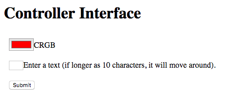

# kawaco
Arduino code for a LED message board. Accepts new messages via HTTP form.

Result looks like the follwing image:


And the web form served by the Arduino:



```http
<!DOCTYPE html>
<html>
<head>
<title>Welcome to Kawaco</title>
</head>
<body>
<h1>Controller Interface</h1>
<h2></h2>
<form method="get">
<div style='padding:10px'><input type="color" name="COLR" value=#FF0000>CRGB</div>
<div style='padding:10px'><input maxlength="30" type="textarea" size="3nameue="">Enter a text (if longer as 10 characters, it will move around).</div>
<div style='padding:10px'><input type="submit" value="Submit"></div>
</form>
</body>
</html>
```
